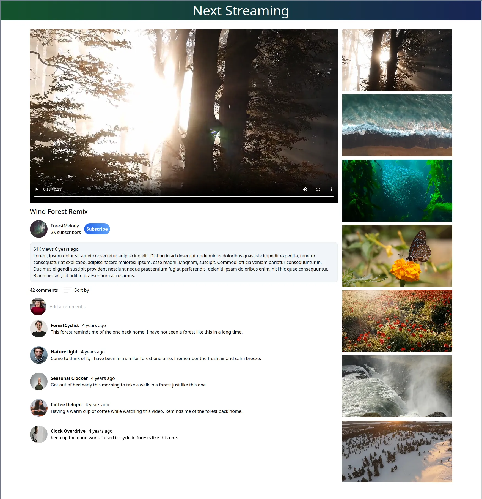

# next-streaming 

Next Streaming is a Next.js microservices application that uses a video service to fetch metadata from MongoDB, sends that data to a video streaming service to acquire videos from Azure, and finally stream them back to the client.

The initial application is not yet tailored to mobile devices and is a work in progress.



---

## Installation Instructions

1. Clone the repo:

```sh
git clone https://github.com/xiraynedev/next-streaming.git
```

2. Change directory:

```sh
cd next-streaming
```

3. Install packages:

```sh
npm i
```

4. Start the dev server by running:

```sh
npm run dev
```